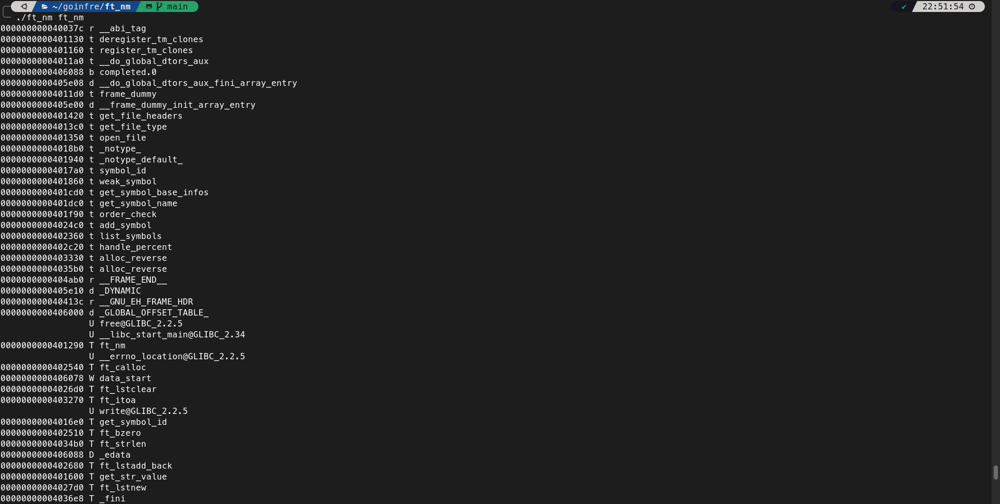

# FT_NM

Like the nm command, list all the symbols in an ELF file



## ELF Format

### Struct Elf32_Ehdr and Elf64_Ehdr

The ELF file header  
At the very beginning of the file

>[!NOTE]
> The .e_ident element contain a magic number

```c
strcmp(.e_ident, "\177ELF":ELFMAG, 4:SELFMAG)
```

To verify if it's a valid ELF file

Then check ```.e_ident[EI_CLASS]```  
== ELFCLASS32: 32bit ELF File  
== ELFCLASS64: 64bit ELF File

```.e_ident[EI_DATA]```  
== ELFDATA2LSB: little endian  
== ELFDATA2MSB: big endian

```.e_ident[EI_VERSION]``` contains info about the OS ABI ID

```.e_ident[EI_ABIVERSION]``` contains the ABI Version

```.e_type```  
== ET_REL: .o  Object file  
== ET_EXEC: Executable  
== ET_DYN: .so  Library  
== ET_CORE: core file  

```.e_machine``` Architecture

```.e_version``` Normally == EV_CURRENT

```.e_shoff``` section header offset  
```.e_shentsize```section header table size
> [!NOTE]
> The ELF file contain a succession of sections starting at .e_shoff and size of .e_shentzise that contains all the data

```.e_shnum``` the number of entry in section header table

```.e_shstrndx``` the section header string table index
> [!NOTE]
> This is where we can find the actual name of the symbols

### Struct Elf32_Shdr and Elf64_Shdr

The section header

```.sh_type``` the section type

The two sections types that interest us here are:

- SHT_SYMTAB: Symbol table
- SHT_DYNSYM: Dynamic symbol table

### Progs headers

```.e_phof``` prog header offset

```.e_phentsiz``` prog header table size

```.e_phnu``` number of entry in prog header table

### Struct Elf32_Sym and Elf64_Sym

The symbol table entry

```.st_nam```    name
```.st_valu```   value
```.st_siz```    size
```.st_inf```    type & binding
```.st_othe```   visibility
```.st_shnd```   index

## Correspondance table

Here are the rules to define the code that will be attributed to a symbol

| Bind (`ELF64_ST_BIND`) | Type (`ELF64_ST_TYPE`) | `st_shndx` Value | Letter | Description | Source of Symbol Name |
|------------------------|------------------------|------------------|--------|-------------|-----------------------|
| `STB_LOCAL` (0)        | `STT_NOTYPE` (0)       | `SHN_UNDEF` (0)  | `u`    | Local undefined symbol (rare, debugging; **no value displayed**) | `.strtab` section, offset by `Elf64_Sym.st_name` (for `SHT_SYMTAB`) or `.dynstr` (for `SHT_DYNSYM`), via `sh_link` |
| `STB_LOCAL`            | `STT_FUNC` (2)         | `SHN_UNDEF` (0)  | `u`    | Local undefined function (rare; **no value displayed**) | `.strtab` section, offset by `Elf64_Sym.st_name` (for `SHT_SYMTAB`) or `.dynstr` (for `SHT_DYNSYM`), via `sh_link` |
| `STB_LOCAL`            | `STT_NOTYPE`           | Section index (code: `.text`, `.plt`) | `t` | Local symbol in code section (display `st_value`) | `.strtab` section, offset by `Elf64_Sym.st_name` (for `SHT_SYMTAB`) or `.dynstr` (for `SHT_DYNSYM`), via `sh_link` |
| `STB_LOCAL`            | `STT_FUNC`             | Section index (code: `.text`, `.plt`) | `t` | Local function in code section (display `st_value`) | `.strtab` section, offset by `Elf64_Sym.st_name` (for `SHT_SYMTAB`) or `.dynstr` (for `SHT_DYNSYM`), via `sh_link` |
| `STB_LOCAL`            | `STT_NOTYPE`           | Section index (data-like: `.data`, `.init_array`, `.fini_array`, `.data.rel.ro`, `.got`, `.got.plt`, `.dynamic`, `.ctors`, `.dtors`, `.jcr`) | `d` | Local symbol in data-like section (display `st_value`) | `.strtab` section, offset by `Elf64_Sym.st_name` (for `SHT_SYMTAB`) or `.dynstr` (for `SHT_DYNSYM`), via `sh_link` |
| `STB_LOCAL`            | `STT_OBJECT` (1)       | Section index (data-like: `.data`, `.init_array`, `.fini_array`, `.data.rel.ro`, `.got`, `.got.plt`, `.dynamic`, `.ctors`, `.dtors`, `.jcr`) | `d` | Local data object in data-like section (display `st_value`) | `.strtab` section, offset by `Elf64_Sym.st_name` (for `SHT_SYMTAB`) or `.dynstr` (for `SHT_DYNSYM`), via `sh_link` |
| `STB_LOCAL`            | `STT_NOTYPE`           | Section index (`.bss`) | `b` | Local symbol in `.bss` (display `st_value`) | `.strtab` section, offset by `Elf64_Sym.st_name` (for `SHT_SYMTAB`) or `.dynstr` (for `SHT_DYNSYM`), via `sh_link` |
| `STB_LOCAL`            | `STT_OBJECT`           | Section index (`.bss`) | `b` | Local data object in `.bss` (display `st_value`) | `.strtab` section, offset by `Elf64_Sym.st_name` (for `SHT_SYMTAB`) or `.dynstr` (for `SHT_DYNSYM`), via `sh_link` |
| `STB_LOCAL`            | `STT_NOTYPE`           | Section index (read-only: `.rodata`, `.rodata1`, `.eh_frame`, `.eh_frame_hdr`, `.note.ABI-tag`) | `r` | Local symbol in read-only section (display `st_value`) | `.strtab` section, offset by `Elf64_Sym.st_name` (for `SHT_SYMTAB`) or `.dynstr` (for `SHT_DYNSYM`), via `sh_link` |
| `STB_LOCAL`            | `STT_OBJECT`           | Section index (read-only: `.rodata`, `.rodata1`, `.eh_frame`, `.eh_frame_hdr`, `.note.ABI-tag`) | `r` | Local data object in read-only section (display `st_value`) | `.strtab` section, offset by `Elf64_Sym.st_name` (for `SHT_SYMTAB`) or `.dynstr` (for `SHT_DYNSYM`), via `sh_link` |
| `STB_LOCAL`            | `STT_SECTION` (3)      | Section index    | `n`    | Section symbol (display `st_value`) | Section name from section header string table (`.shstrtab`), offset by `Elf64_Shdr.sh_name` for the section at `st_shndx` |
| `STB_LOCAL`            | `STT_FILE` (4)         | `SHN_ABS`        | `n`    | Source file name (display `st_value`) | `.strtab` section, offset by `Elf64_Sym.st_name` (for `SHT_SYMTAB`), via `sh_link` |
| `STB_LOCAL`            | `STT_NOTYPE`/`STT_OBJECT` | `SHN_ABS`     | `a`    | Local absolute symbol (display `st_value`) | `.strtab` section, offset by `Elf64_Sym.st_name` (for `SHT_SYMTAB`) or `.dynstr` (for `SHT_DYNSYM`), via `sh_link` |
| `STB_GLOBAL` (1)       | `STT_NOTYPE`           | `SHN_UNDEF`      | `U`    | Undefined global symbol (**no value displayed**) | `.strtab` section, offset by `Elf64_Sym.st_name` (for `SHT_SYMTAB`) or `.dynstr` (for `SHT_DYNSYM`), via `sh_link` |
| `STB_GLOBAL`           | `STT_FUNC`             | `SHN_UNDEF`      | `U`    | Undefined global function (**no value displayed**) | `.strtab` section, offset by `Elf64_Sym.st_name` (for `SHT_SYMTAB`) or `.dynstr` (for `SHT_DYNSYM`), via `sh_link` |
| `STB_GLOBAL`           | `STT_NOTYPE`           | `SHN_COMMON`     | `C`    | Common symbol (unallocated; display `st_value`) | `.strtab` section, offset by `Elf64_Sym.st_name` (for `SHT_SYMTAB`) or `.dynstr` (for `SHT_DYNSYM`), via `sh_link` |
| `STB_GLOBAL`           | `STT_NOTYPE`           | Section index (code: `.text`, `.plt`) | `T` | Global symbol in code section (display `st_value`) | `.strtab` section, offset by `Elf64_Sym.st_name` (for `SHT_SYMTAB`) or `.dynstr` (for `SHT_DYNSYM`), via `sh_link` |
| `STB_GLOBAL`           | `STT_FUNC`             | Section index (code: `.text`, `.plt`) | `T` | Global function in code section (display `st_value`) | `.strtab` section, offset by `Elf64_Sym.st_name` (for `SHT_SYMTAB`) or `.dynstr` (for `SHT_DYNSYM`), via `sh_link` |
| `STB_GLOBAL`           | `STT_NOTYPE`           | Section index (data-like: `.data`, `.init_array`, `.fini_array`, `.data.rel.ro`, `.got`, `.got.plt`, `.dynamic`, `.ctors`, `.dtors`, `.jcr`) | `D` | Global symbol in data-like section (display `st_value`) | `.strtab` section, offset by `Elf64_Sym.st_name` (for `SHT_SYMTAB`) or `.dynstr` (for `SHT_DYNSYM`), via `sh_link` |
| `STB_GLOBAL`           | `STT_OBJECT`           | Section index (data-like: `.data`, `.init_array`, `.fini_array`, `.data.rel.ro`, `.got`, `.got.plt`, `.dynamic`, `.ctors`, `.dtors`, `.jcr`) | `D` | Global data object in data-like section (display `st_value`) | `.strtab` section, offset by `Elf64_Sym.st_name` (for `SHT_SYMTAB`) or `.dynstr` (for `SHT_DYNSYM`), via `sh_link` |
| `STB_GLOBAL`           | `STT_NOTYPE`           | Section index (`.bss`) | `B` | Global symbol in `.bss` (display `st_value`) | `.strtab` section, offset by `Elf64_Sym.st_name` (for `SHT_SYMTAB`) or `.dynstr` (for `SHT_DYNSYM`), via `sh_link` |
| `STB_GLOBAL`           | `STT_OBJECT`           | Section index (`.bss`) | `B` | Global data object in `.bss` (display `st_value`) | `.strtab` section, offset by `Elf64_Sym.st_name` (for `SHT_SYMTAB`) or `.dynstr` (for `SHT_DYNSYM`), via `sh_link` |
| `STB_GLOBAL`           | `STT_NOTYPE`           | Section index (read-only: `.rodata`, `.rodata1`, `.eh_frame`, `.eh_frame_hdr`, `.note.ABI-tag`) | `R` | Global symbol in read-only section (display `st_value`) | `.strtab` section, offset by `Elf64_Sym.st_name` (for `SHT_SYMTAB`) or `.dynstr` (for `SHT_DYNSYM`), via `sh_link` |
| `STB_GLOBAL`           | `STT_OBJECT`           | Section index (read-only: `.rodata`, `.rodata1`, `.eh_frame`, `.eh_frame_hdr`, `.note.ABI-tag`) | `R` | Global data object in read-only section (display `st_value`) | `.strtab` section, offset by `Elf64_Sym.st_name` (for `SHT_SYMTAB`) or `.dynstr` (for `SHT_DYNSYM`), via `sh_link` |
| `STB_GLOBAL`           | `STT_NOTYPE`/`STT_OBJECT` | `SHN_ABS`     | `A`    | Global absolute symbol (display `st_value`) | `.strtab` section, offset by `Elf64_Sym.st_name` (for `SHT_SYMTAB`) or `.dynstr` (for `SHT_DYNSYM`), via `sh_link` |
| `STB_WEAK` (2)         | `STT_NOTYPE`/`STT_OBJECT` | `SHN_UNDEF` | `w`    | Weak undefined symbol (**no value displayed**) | `.strtab` section, offset by `Elf64_Sym.st_name` (for `SHT_SYMTAB`) or `.dynstr` (for `SHT_DYNSYM`), via `sh_link` |
| `STB_WEAK`             | `STT_FUNC`             | `SHN_UNDEF`      | `w`    | Weak undefined function (**no value displayed**) | `.strtab` section, offset by `Elf64_Sym.st_name` (for `SHT_SYMTAB`) or `.dynstr` (for `SHT_DYNSYM`), via `sh_link` |
| `STB_WEAK`             | `STT_NOTYPE`           | `SHN_COMMON`     | `C`    | Weak common symbol (display `st_value`) | `.strtab` section, offset by `Elf64_Sym.st_name` (for `SHT_SYMTAB`) or `.dynstr` (for `SHT_DYNSYM`), via `sh_link` |
| `STB_WEAK`             | `STT_NOTYPE`           | Section index (code: `.text`, `.plt`) | `W` | Weak symbol in code section (display `st_value`) | `.strtab` section, offset by `Elf64_Sym.st_name` (for `SHT_SYMTAB`) or `.dynstr` (for `SHT_DYNSYM`), via `sh_link` |
| `STB_WEAK`             | `STT_FUNC`             | Section index (code: `.text`, `.plt`) | `W` | Weak function in code section (display `st_value`) | `.strtab` section, offset by `Elf64_Sym.st_name` (for `SHT_SYMTAB`) or `.dynstr` (for `SHT_DYNSYM`), via `sh_link` |
| `STB_WEAK`             | `STT_NOTYPE`           | Section index (data-like: `.data`, `.init_array`, `.fini_array`, `.data.rel.ro`, `.got`, `.got.plt`, `.dynamic`, `.ctors`, `.dtors`, `.jcr`) | `W` | Weak symbol in data-like section (display `st_value`) | `.strtab` section, offset by `Elf64_Sym.st_name` (for `SHT_SYMTAB`) or `.dynstr` (for `SHT_DYNSYM`), via `sh_link` |
| `STB_WEAK`             | `STT_OBJECT`           | Section index (data-like: `.data`, `.init_array`, `.fini_array`, `.data.rel.ro`, `.got`, `.got.plt`, `.dynamic`, `.ctors`, `.dtors`, `.jcr`) | `W` | Weak data object in data-like section (display `st_value`) | `.strtab` section, offset by `Elf64_Sym.st_name` (for `SHT_SYMTAB`) or `.dynstr` (for `SHT_DYNSYM`), via `sh_link` |
| `STB_WEAK`             | `STT_NOTYPE`           | Section index (`.bss`) | `W` | Weak symbol in `.bss` (display `st_value`) | `.strtab` section, offset by `Elf64_Sym.st_name` (for `SHT_SYMTAB`) or `.dynstr` (for `SHT_DYNSYM`), via `sh_link` |
| `STB_WEAK`             | `STT_OBJECT`           | Section index (`.bss`) | `W` | Weak data object in `.bss` (display `st_value`) | `.strtab` section, offset by `Elf64_Sym.st_name` (for `SHT_SYMTAB`) or `.dynstr` (for `SHT_DYNSYM`), via `sh_link` |
| `STB_WEAK`             | `STT_NOTYPE`           | Section index (read-only: `.rodata`, `.rodata1`, `.eh_frame`, `.eh_frame_hdr`, `.note.ABI-tag`) | `W` | Weak symbol in read-only section (display `st_value`) | `.strtab` section, offset by `Elf64_Sym.st_name` (for `SHT_SYMTAB`) or `.dynstr` (for `SHT_DYNSYM`), via `sh_link` |
| `STB_WEAK`             | `STT_OBJECT`           | Section index (read-only: `.rodata`, `.rodata1`, `.eh_frame`, `.eh_frame_hdr`, `.note.ABI-tag`) | `W` | Weak data object in read-only section (display `st_value`) | `.strtab` section, offset by `Elf64_Sym.st_name` (for `SHT_SYMTAB`) or `.dynstr` (for `SHT_DYNSYM`), via `sh_link` |
| `STB_WEAK`             | `STT_NOTYPE`/`STT_OBJECT` | `SHN_ABS`     | `W`    | Weak absolute symbol (display `st_value`) | `.strtab` section, offset by `Elf64_Sym.st_name` (for `SHT_SYMTAB`) or `.dynstr` (for `SHT_DYNSYM`), via `sh_link` |
